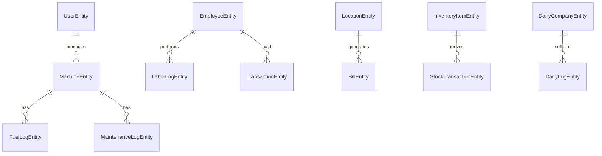

# AgriManager Project Analysis

## Executive Summary

**AgriManager** is a comprehensive Android farm management application built with modern Android development practices. The app provides specialized modules for high-level farm management, including maquinaria, labor, inventory, and a newly implemented **Dairy module** with role-based data entry and automatic rate calculations. It features a robust offline-first synchronization engine using Firebase Firestore.

---

## 📱 Project Overview

- **Package Name**: `com.example.agrimanager`
- **Language**: Kotlin
- **Min SDK**: 24 (Android 7.0)
- **Target SDK**: 34 (Android 14)
- **Database Version**: 11
- **Architecture**: MVVM with Repository Pattern & Offline-First Sync
- **Roles**: Owner (Full Access), Manager (Data Entry + Viewing)

---

## 🏗️ Technology Stack

### Core Technologies
- **UI Framework**: Jetpack Compose with Material 3
- **Dependency Injection**: Dagger Hilt
- **Database**: Room Persistence Library
- **Navigation**: Jetpack Navigation Compose
- **Authentication**: Firebase Auth
- **Cloud Storage**: Firebase Firestore
- **Background Tasks**: WorkManager for reliable Firestore sync
- **Reports**: iText7 for PDF generation

---

## 📊 Database Schema

The app uses **13 database entities** organized in a Room database:

### Core Entities
1. **UserEntity**: Manages role-based access (Owner/Manager).
2. **MachineEntity**: Tracks farm machinery/equipment.
3. **LocationEntity**: Manages farm locations/plots.
4. **EmployeeEntity**: Stores worker information and salary bases.
5. **InventoryItemEntity**: Manages stock items (fertilizers, seeds, etc.).

### Transactional & Log Entities
6. **FuelLogEntity**: Records fuel consumption for machines.
7. **MaintenanceLogEntity**: Tracks machine service records (Oil, Tyres, etc.).
8. **LaborLogEntity**: Records daily labor activities and costs.
9. **BillEntity**: Records utility bills per location.
10. **TransactionEntity**: Tracks salary advances and payments.
11. **StockTransactionEntity**: Tracks inventory movements (IN/OUT).

### Dairy Module Entities (New)
12. **DairyCompanyEntity**: Stores dairy companies and their specific **Rate per Liter**.
13. **DairyLogEntity**: Records daily milk production with automatic price calculation.

### Schema Relationships


---

## 🎯 Features & Modules

### 1. **User Role Management**
- **Owner**: Manages the farm, adds managers, sets dairy rates, and deletes historical data.
- **Manager**: Performs data entry for fuel, labor, and milk logs. Actions are synced to the owner's farm collection.

### 2. **Dairy Module (Latest)**
- **Company-Based Rates**: Owners define rates per company.
- **Auto-Calculation**: Liters × Rate is calculated instantly upon entry to ensure historical accuracy.
- **Revenue Tracking**: Integrated directly into analytics.

### 3. **Smart Notification System**
- **New Data Indicators**: Red dots appear on dashboard modules (Labor, Dairy, etc.) when other users add data or sync completes.
- **Auto-Clear**: Notifications clear automatically once a user views the relevant module.

### 4. **Analytics & Reporting**
- **Income vs Expense**: Differentiates between operational costs and revenue (like Milk Sales).
- **PDF Export**: Generates professional PDF reports with custom date ranges, now including Dairy production logs.

---

## 🔄 Data Synchronization

### Robust Sync Engine
- **Local-First**: Works 100% offline.
- **WorkManager Sync**: Enqueues sync jobs that retry automatically with exponential backoff.
- **Cross-Role Sync**: Data added by a Manager is synced to the Owner's Firestore prefix, allowing the Owner to see farm updates in real-time.
- **Sync Status**: Real-time dashboard indicator shows "Syncing...", "Pending", or "Synced" states.

---

## 📁 Project Structure

```
app/src/main/java/com/example/agrimanager/
├── data/
│   ├── local/          # Room Entities, DAOs, and Migration log
│   └── repository/     # Data coordination (Auth, Farm, etc.)
├── ui/                 # Feature-based packages (dairy, fuel, labor, etc.)
├── utils/              # PDF Manager, Sync Status, Permission Helpers
└── workers/            # Firestore Synchronization logic
```

---

## ✅ Recent Enhancements (Dec 2025)

1. **Dairy Module**: Full vertical implementation from DB to Analytics.
2. **Notification system**: Fixed timing issues ensuring cross-user data visibility.
3. **Role Security**: Implemented `PermissionHelper` to restrict critical settings to Owners.
4. **PDF Engine**: Expanded to include Maintenance and Dairy logs.

---

## 🚀 Conclusion
AgriManager has evolved from a simple logbook into a multi-user farm management platform. The addition of the Dairy module and refined synchronization logic makes it a powerful tool for modern agriculture.
