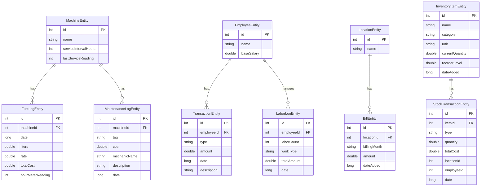

# AgriManager Project Analysis

## Executive Summary

**AgriManager** is a comprehensive Android farm management application built with modern Android development practices. The app helps farmers and agricultural managers track various aspects of farm operations including machinery, labor, inventory, bills, salaries, and maintenance.

---

## 📱 Project Overview

- **Package Name**: `com.example.agrimanager`
- **Language**: Kotlin
- **Min SDK**: 24 (Android 7.0)
- **Target SDK**: 34 (Android 14)
- **Database Version**: 6
- **Architecture**: MVVM with Repository Pattern

---

## 🏗️ Technology Stack

### Core Technologies
- **UI Framework**: Jetpack Compose with Material 3
- **Dependency Injection**: Dagger Hilt (using KSP instead of KAPT)
- **Database**: Room Persistence Library
- **Navigation**: Jetpack Navigation Compose
- **Authentication**: Firebase Auth
- **Cloud Storage**: Firebase Firestore
- **Background Tasks**: WorkManager for Firestore sync

### Key Dependencies
```kotlin
// Core
- androidx.core:core-ktx:1.12.0
- androidx.lifecycle:lifecycle-runtime-ktx:2.7.0
- androidx.activity:activity-compose:1.8.2

// Compose
- compose-bom:2023.08.00
- Material 3 with extended icons

// Navigation
- navigation-compose:2.7.7

// Hilt (DI)
- hilt-android:2.50 (using KSP)
- hilt-navigation-compose:1.2.0

// Room Database
- room:2.6.1 (using KSP)

// Firebase
- firebase-bom:33.1.0
- firebase-auth
- firebase-firestore

// WorkManager
- work-runtime-ktx:2.9.0
```

---

## 📊 Database Schema

### Entities Overview

The app uses **9 database entities** organized in a Room database:

#### 1. **MachineEntity**
Tracks farm machinery/equipment.
```kotlin
- id: Int (PK, auto-generated)
- name: String
- serviceIntervalHours: Int
- lastServiceReading: Int
```

#### 2. **FuelLogEntity**
Records fuel consumption for machines.
```kotlin
- id: Int (PK)
- machineId: Int (FK → MachineEntity)
- date: Long
- liters: Double
- rate: Double
- totalCost: Double
- hourMeterReading: Int
```

#### 3. **EmployeeEntity**
Stores employee/worker information.
```kotlin
- id: Int (PK)
- name: String
- baseSalary: Double
```

#### 4. **TransactionEntity**
Tracks salary advances and payments.
```kotlin
- id: Int (PK)
- employeeId: Int (FK → EmployeeEntity)
- type: String (DEBIT/CREDIT)
- amount: Double
- date: Long
- description: String
```

#### 5. **LocationEntity**
Manages farm locations/plots.
```kotlin
- id: Int (PK)
- name: String
```

#### 6. **BillEntity**
Records utility bills per location.
```kotlin
- id: Int (PK)
- locationId: Int (FK → LocationEntity)
- billingMonth: String
- amount: Double
- dateAdded: Long
```

#### 7. **InventoryItemEntity**
Manages stock items (fertilizers, seeds, etc.).
```kotlin
- id: Int (PK)
- name: String
- category: String
- unit: String
- currentQuantity: Double
- reorderLevel: Double
- dateAdded: Long
```

#### 8. **StockTransactionEntity**
Tracks inventory movements (IN/OUT).
```kotlin
- id: Int (PK)
- itemId: Int (FK → InventoryItemEntity)
- type: String (IN/OUT)
- quantity: Double
- totalCost: Double
- locationId: Int (optional)
- employeeId: Int (optional)
- date: Long
```

#### 9. **LaborLogEntity**
Records daily labor activities.
```kotlin
- id: Int (PK)
- employeeId: Int (FK → EmployeeEntity)
- laborCount: Int
- workType: String
- totalAmount: Double
- date: Long
```

#### 10. **MaintenanceLogEntity**
Tracks machine maintenance records.
```kotlin
- id: Int (PK)
- machineId: Int (FK → MachineEntity)
- tag: String (Oil Change, Tyre, Battery, etc.)
- cost: Double
- mechanicName: String
- description: String
- date: Long
```

### Database Relationships



---

## 🎯 Features & Modules

### 1. **Authentication Module**
- Firebase-based email/password authentication
- Sign up and sign in functionality
- Persistent login state
- Logout capability

**Files:**
- [AuthRepository.kt](file:///c:/Users/CW/AndroidStudioProjects/AgriManager/app/src/main/java/com/example/agrimanager/data/repository/AuthRepository.kt)
- [AuthViewModel.kt](file:///c:/Users/CW/AndroidStudioProjects/AgriManager/app/src/main/java/com/example/agrimanager/ui/auth/AuthViewModel.kt)
- [LoginScreen.kt](file:///c:/Users/CW/AndroidStudioProjects/AgriManager/app/src/main/java/com/example/agrimanager/ui/auth/LoginScreen.kt)

### 2. **Dashboard**
Central hub with 6 quick action buttons in a 3x2 grid layout:
- Fuel Management
- Labor Tracking
- Stock/Inventory
- Bill Management
- Salary Management
- Maintenance Logs

**Files:**
- [DashboardScreen.kt](file:///c:/Users/CW/AndroidStudioProjects/AgriManager/app/src/main/java/com/example/agrimanager/ui/dashboard/DashboardScreen.kt)

### 3. **Fuel Management**
- Machine list view
- Add/delete machines
- Track fuel logs per machine
- Calculate total fuel costs
- Hour meter readings for service tracking

**Files:**
- [MachineListScreen.kt](file:///c:/Users/CW/AndroidStudioProjects/AgriManager/app/src/main/java/com/example/agrimanager/ui/machine/MachineListScreen.kt)
- [MachineViewModel.kt](file:///c:/Users/CW/AndroidStudioProjects/AgriManager/app/src/main/java/com/example/agrimanager/ui/machine/MachineViewModel.kt)
- [FuelLogScreen.kt](file:///c:/Users/CW/AndroidStudioProjects/AgriManager/app/src/main/java/com/example/agrimanager/ui/fuel/FuelLogScreen.kt)
- [FuelLogViewModel.kt](file:///c:/Users/CW/AndroidStudioProjects/AgriManager/app/src/main/java/com/example/agrimanager/ui/fuel/FuelLogViewModel.kt)

### 4. **Labor Management**
- Add labor logs with employee selection
- Track work types (Harvesting, Watering, Weeding, Sowing, Fertilizing)
- Record labor count and total amount
- View and delete labor logs
- Integration with employee database

**Files:**
- [LaborListScreen.kt](file:///c:/Users/CW/AndroidStudioProjects/AgriManager/app/src/main/java/com/example/agrimanager/ui/labor/LaborListScreen.kt)
- [AddLaborLogScreen.kt](file:///c:/Users/CW/AndroidStudioProjects/AgriManager/app/src/main/java/com/example/agrimanager/ui/labor/AddLaborLogScreen.kt)
- [LaborViewModel.kt](file:///c:/Users/CW/AndroidStudioProjects/AgriManager/app/src/main/java/com/example/agrimanager/ui/labor/LaborViewModel.kt)

### 5. **Inventory/Stock Management**
- Add inventory items with categories
- Track current quantity and reorder levels
- Record stock IN transactions (purchases)
- Record stock OUT transactions (usage)
- View transaction history per item
- Detailed item view with transaction logs

**Files:**
- [InventoryListScreen.kt](file:///c:/Users/CW/AndroidStudioProjects/AgriManager/app/src/main/java/com/example/agrimanager/ui/inventory/InventoryListScreen.kt)
- [InventoryDetailScreen.kt](file:///c:/Users/CW/AndroidStudioProjects/AgriManager/app/src/main/java/com/example/agrimanager/ui/inventory/InventoryDetailScreen.kt)
- [InventoryViewModel.kt](file:///c:/Users/CW/AndroidStudioProjects/AgriManager/app/src/main/java/com/example/agrimanager/ui/inventory/InventoryViewModel.kt)

### 6. **Bill Management**
- Manage farm locations
- Add bills per location
- Track billing by month
- View total bills per location
- Location-based bill organization

**Files:**
- [BillListScreen.kt](file:///c:/Users/CW/AndroidStudioProjects/AgriManager/app/src/main/java/com/example/agrimanager/ui/bill/BillListScreen.kt)
- [BillViewModel.kt](file:///c:/Users/CW/AndroidStudioProjects/AgriManager/app/src/main/java/com/example/agrimanager/ui/bill/BillViewModel.kt)
- [LocationListScreen.kt](file:///c:/Users/CW/AndroidStudioProjects/AgriManager/app/src/main/java/com/example/agrimanager/ui/location/LocationListScreen.kt)
- [LocationViewModel.kt](file:///c:/Users/CW/AndroidStudioProjects/AgriManager/app/src/main/java/com/example/agrimanager/ui/location/LocationViewModel.kt)

### 7. **Salary Management**
- Employee list management
- Add/delete employees
- Track base salary
- Record salary advances (DEBIT transactions)
- Record salary payments (CREDIT transactions)
- Calculate total advances per employee
- Detailed salary screen per employee

**Files:**
- [EmployeeListScreen.kt](file:///c:/Users/CW/AndroidStudioProjects/AgriManager/app/src/main/java/com/example/agrimanager/ui/employee/EmployeeListScreen.kt)
- [EmployeeViewModel.kt](file:///c:/Users/CW/AndroidStudioProjects/AgriManager/app/src/main/java/com/example/agrimanager/ui/employee/EmployeeViewModel.kt)
- [SalaryScreen.kt](file:///c:/Users/CW/AndroidStudioProjects/AgriManager/app/src/main/java/com/example/agrimanager/ui/employee/SalaryScreen.kt)
- [SalaryViewModel.kt](file:///c:/Users/CW/AndroidStudioProjects/AgriManager/app/src/main/java/com/example/agrimanager/ui/employee/SalaryViewModel.kt)

### 8. **Maintenance Management**
- Add maintenance logs for machines
- Categorize by tags (Oil Change, Tyre, Battery, Engine, Other)
- Record mechanic name and cost
- Add detailed descriptions
- View and delete maintenance records
- Machine-based organization

**Files:**
- [MaintenanceListScreen.kt](file:///c:/Users/CW/AndroidStudioProjects/AgriManager/app/src/main/java/com/example/agrimanager/ui/maintenance/MaintenanceListScreen.kt)
- [AddMaintenanceLogScreen.kt](file:///c:/Users/CW/AndroidStudioProjects/AgriManager/app/src/main/java/com/example/agrimanager/ui/maintenance/AddMaintenanceLogScreen.kt)
- [MaintenanceViewModel.kt](file:///c:/Users/CW/AndroidStudioProjects/AgriManager/app/src/main/java/com/example/agrimanager/ui/maintenance/MaintenanceViewModel.kt)

---

## 🏛️ Architecture

### MVVM Pattern
The app follows the **Model-View-ViewModel** architecture:

```
┌─────────────────┐
│   UI Layer      │  Jetpack Compose Screens
│  (Composables)  │
└────────┬────────┘
         │
         ↓
┌─────────────────┐
│   ViewModel     │  State Management & Business Logic
│     Layer       │
└────────┬────────┘
         │
         ↓
┌─────────────────┐
│   Repository    │  Data Coordination
│     Layer       │
└────────┬────────┘
         │
         ↓
┌─────────────────┐
│   Data Layer    │  Room DAO + Firebase
│  (Local/Remote) │
└─────────────────┘
```

### Repository Pattern
**FarmRepository** acts as a single source of truth, coordinating between:
- Local database (Room)
- Remote storage (Firestore)
- Background sync (WorkManager)

### Dependency Injection
Uses **Dagger Hilt** for dependency injection with KSP (Kotlin Symbol Processing) for faster builds.

**Provided Dependencies:**
- `FarmDatabase` - Room database instance
- `FarmDao` - Database access object
- `FirebaseAuth` - Authentication instance
- `Context` - Application context

---

## 🔄 Data Synchronization

### Background Sync Strategy
The app implements **offline-first architecture** with background sync:

1. **Local-First**: All operations write to Room database immediately
2. **Background Sync**: WorkManager schedules Firestore sync when network available
3. **Retry Logic**: Exponential backoff for failed syncs
4. **Network Constraints**: Only syncs when connected to internet

### FirestoreSyncWorker
Handles background synchronization for:
- Machines
- Fuel logs
- Locations
- Bills

**Features:**
- Automatic retry on failure
- Network-aware scheduling
- Support for both SET and DELETE operations
- Type-safe data serialization

**File:**
- [FirestoreSyncWorker.kt](file:///c:/Users/CW/AndroidStudioProjects/AgriManager/app/src/main/java/com/example/agrimanager/workers/FirestoreSyncWorker.kt)

---

## 🗺️ Navigation Structure

### Route Hierarchy
```
login (start if not authenticated)
  └─→ dashboard (start if authenticated)
       ├─→ machine_list
       │    └─→ fuel_logs/{machineId}
       ├─→ bill_list
       │    └─→ location_list
       ├─→ employee_list
       │    └─→ salary/{employeeId}
       ├─→ inventory_list
       │    └─→ inventory_detail/{itemId}
       ├─→ labor_list
       │    └─→ add_labor_log
       └─→ maintenance_list
            └─→ add_maintenance_log
```

### Navigation Implementation
- **NavHost** in [MainActivity.kt](file:///c:/Users/CW/AndroidStudioProjects/AgriManager/app/src/main/java/com/example/agrimanager/MainActivity.kt)
- Dynamic start destination based on auth state
- Proper backstack management
- Type-safe navigation arguments

---

## 📁 Project Structure

```
app/src/main/java/com/example/agrimanager/
│
├── AgriApplication.kt          # Hilt application class
├── MainActivity.kt             # Single activity with NavHost
│
├── data/
│   ├── local/                  # Room database layer
│   │   ├── FarmDatabase.kt     # Database definition
│   │   ├── FarmDao.kt          # DAO with all queries
│   │   ├── *Entity.kt          # 9 entity classes
│   │   ├── *WithRelation.kt    # Join result classes
│   │   ├── EmployeeDao.kt      # Separate employee DAO
│   │   └── TransactionDao.kt   # Separate transaction DAO
│   │
│   └── repository/             # Repository layer
│       ├── FarmRepository.kt   # Main repository
│       └── AuthRepository.kt   # Authentication repository
│
├── di/
│   └── AppModule.kt            # Hilt dependency injection
│
├── ui/                         # UI layer (Compose)
│   ├── auth/                   # Login/signup screens
│   ├── dashboard/              # Dashboard screen
│   ├── machine/                # Machine management
│   ├── fuel/                   # Fuel log screens
│   ├── employee/               # Employee & salary screens
│   ├── bill/                   # Bill management
│   ├── location/               # Location management
│   ├── inventory/              # Inventory screens
│   ├── labor/                  # Labor log screens
│   ├── maintenance/            # Maintenance screens
│   └── theme/                  # Material 3 theming
│
└── workers/
    └── FirestoreSyncWorker.kt  # Background sync worker
```

---

## 🎨 UI/UX Design

### Design System
- **Material 3** design language
- **Extended Material Icons** for comprehensive icon set
- Custom color scheme with primary container colors
- Responsive layouts with Compose

### Dashboard Design
- **3x2 Grid Layout** with circular action buttons
- Color-coded modules:
  - 🟡 Fuel (Amber)
  - 🔵 Labor (Blue)
  - 🟢 Stock (Green)
  - 🟣 Bill (Purple)
  - 🔷 Salary (Teal)
  - 🔴 Maintenance (Deep Orange)

### Common UI Patterns
- Top app bars with navigation
- Floating action buttons for add operations
- Card-based list items
- Dialog forms for data entry
- Swipe-to-delete functionality (in some modules)

---

## 🔧 Build Configuration

### Gradle Setup
- **Kotlin DSL** for build scripts
- **KSP** instead of KAPT for annotation processing
- **Compose BOM** for version management
- **Firebase BOM** for Firebase dependencies

### Build Features
- Jetpack Compose enabled
- Vector drawable support
- ProGuard rules for release builds
- Destructive migration for Room (development mode)

### Compiler Options
- Java 8 compatibility
- Kotlin compiler extension version: 1.5.1
- JVM target: 1.8

---

## ✅ Strengths

1. **Modern Architecture**: Clean MVVM with repository pattern
2. **Offline-First**: Local database with background sync
3. **Type Safety**: Kotlin with strong typing throughout
4. **Dependency Injection**: Proper DI with Hilt
5. **Reactive Data**: Flow-based reactive streams
6. **Modern UI**: Jetpack Compose with Material 3
7. **Comprehensive Features**: Covers multiple farm management aspects
8. **Foreign Key Constraints**: Proper database relationships
9. **Background Processing**: WorkManager for reliable sync
10. **Authentication**: Firebase Auth integration

---

## 🔍 Areas for Improvement

### 1. **Incomplete Firestore Sync**
Currently, only 4 entities sync to Firestore:
- ✅ Machines
- ✅ Fuel logs
- ✅ Locations
- ✅ Bills
- ❌ Employees
- ❌ Transactions
- ❌ Inventory
- ❌ Labor logs
- ❌ Maintenance logs

**Recommendation**: Extend `scheduleSync()` calls in `FarmRepository` for all entities.

### 2. **Error Handling**
Limited error handling in UI layer. Consider:
- User-friendly error messages
- Retry mechanisms in UI
- Offline state indicators
- Network status monitoring

### 3. **Data Validation**
Add input validation for:
- Negative quantities
- Empty strings
- Date range validations
- Duplicate entries

### 4. **Testing**
No test files found. Consider adding:
- Unit tests for ViewModels
- Repository tests
- DAO tests
- UI tests with Compose testing

### 5. **Pagination**
Large datasets might cause performance issues. Consider:
- Paging 3 library for lists
- Lazy loading for transactions
- Date-based filtering

### 6. **Analytics**
Add Firebase Analytics to track:
- Feature usage
- User engagement
- Error tracking
- Performance monitoring

### 7. **Security**
Consider adding:
- ProGuard rules for release
- Data encryption at rest
- Secure credential storage
- API key protection

### 8. **Accessibility**
Enhance accessibility with:
- Content descriptions
- Semantic properties
- Screen reader support
- High contrast mode

### 9. **Documentation**
Add:
- KDoc comments for public APIs
- README with setup instructions
- Architecture decision records
- API documentation

### 10. **Localization**
Currently hardcoded strings. Consider:
- String resources
- Multi-language support
- Date/number formatting

---

## 📈 Metrics

- **Total Kotlin Files**: 50
- **Database Entities**: 9
- **UI Screens**: ~15
- **ViewModels**: 8
- **Repositories**: 2
- **Database Version**: 6
- **Lines of Code**: ~3,500+ (estimated)

---

## 🚀 Getting Started

### Prerequisites
- Android Studio Hedgehog or later
- JDK 8 or higher
- Android SDK 34
- Firebase project setup

### Setup Steps
1. Clone the repository
2. Open in Android Studio
3. Add `google-services.json` from Firebase Console
4. Sync Gradle dependencies
5. Run on emulator or physical device (API 24+)

### First Run
1. App opens to login screen
2. Create account with email/password
3. Access dashboard with 6 modules
4. Start adding data to respective modules

---

## 🔐 Firebase Configuration

### Required Firebase Services
- **Authentication**: Email/Password provider enabled
- **Firestore**: Database with appropriate security rules
- **Google Services**: `google-services.json` in `app/` directory

### Firestore Collections
- `machines`
- `fuel_logs`
- `locations`
- `bills`

---

## 📝 Recent Changes

Based on conversation history, the most recent work included:

### Labor Module Implementation (Dec 5, 2025)
- ✅ Created `LaborLogEntity` and `LaborLogWithEmployee`
- ✅ Added DAO methods for labor logs
- ✅ Updated `FarmRepository` with labor operations
- ✅ Built `AddLaborLogScreen` with employee dropdown
- ✅ Built `LaborListScreen` with deletable cards
- ✅ Integrated labor module with dashboard
- ✅ Removed "Paid By" field as requested
- ✅ Implemented data persistence

---

## 🎯 Conclusion

**AgriManager** is a well-structured, modern Android application that demonstrates best practices in Android development. It successfully implements a comprehensive farm management system with offline-first architecture, proper separation of concerns, and a clean, intuitive UI.

The app is production-ready for core features but would benefit from:
- Complete Firestore sync coverage
- Comprehensive testing
- Enhanced error handling
- Performance optimizations for large datasets

Overall, this is a **solid foundation** for a farm management application with room for growth and enhancement.


Granular Rules (Recommended for Production)


rules_version = '2';
service cloud.firestore {
  match /databases/{database}/documents {
    
    // Helper function to check if user is authenticated
    function isAuthenticated() {
      return request.auth != null;
    }
    
    // Helper function to check if user owns the data
    function isOwner(userId) {
      return request.auth.uid == userId;
    }
    
    // Machines Collection
    match /machines/{machineId} {
      allow read: if isAuthenticated();
      allow create: if isAuthenticated();
      allow update: if isAuthenticated();
      allow delete: if isAuthenticated();
    }
    
    // Fuel Logs Collection
    match /fuel_logs/{logId} {
      allow read: if isAuthenticated();
      allow create: if isAuthenticated();
      allow update: if isAuthenticated();
      allow delete: if isAuthenticated();
    }
    
    // Locations Collection
    match /locations/{locationId} {
      allow read: if isAuthenticated();
      allow create: if isAuthenticated();
      allow update: if isAuthenticated();
      allow delete: if isAuthenticated();
    }
    
    // Bills Collection
    match /bills/{billId} {
      allow read: if isAuthenticated();
      allow create: if isAuthenticated();
      allow update: if isAuthenticated();
      allow delete: if isAuthenticated();
    }
    
    // Employees Collection
    match /employees/{employeeId} {
      allow read: if isAuthenticated();
      allow create: if isAuthenticated();
      allow update: if isAuthenticated();
      allow delete: if isAuthenticated();
    }
    
    // Transactions Collection (Salary)
    match /transactions/{transactionId} {
      allow read: if isAuthenticated();
      allow create: if isAuthenticated();
      allow update: if isAuthenticated();
      allow delete: if isAuthenticated();
    }
    
    // Inventory Items Collection
    match /inventory_items/{itemId} {
      allow read: if isAuthenticated();
      allow create: if isAuthenticated();
      allow update: if isAuthenticated();
      allow delete: if isAuthenticated();
    }
    
    // Stock Transactions Collection
    match /stock_transactions/{transactionId} {
      allow read: if isAuthenticated();
      allow create: if isAuthenticated();
      allow update: if isAuthenticated();
      allow delete: if isAuthenticated();
    }
    
    // Labor Logs Collection
    match /labor_logs/{logId} {
      allow read: if isAuthenticated();
      allow create: if isAuthenticated();
      allow update: if isAuthenticated();
      allow delete: if isAuthenticated();
    }
    
    // Maintenance Logs Collection
    match /maintenance_logs/{logId} {
      allow read: if isAuthenticated();
      allow create: if isAuthenticated();
      allow update: if isAuthenticated();
      allow delete: if isAuthenticated();
    }
  }
}


User-Specific Rules (For Multi-User/Multi-Farm Setup)
Note: Option 3 requires adding 
userId
 field to all sync operations in your code.

rules_version = '2';
service cloud.firestore {
  match /databases/{database}/documents {
    
    // Helper functions
    function isAuthenticated() {
      return request.auth != null;
    }
    
    function isOwner() {
      return request.auth.uid == resource.data.userId;
    }
    
    function isCreator() {
      return request.auth.uid == request.resource.data.userId;
    }
    
    // All collections require userId field and user can only access their own data
    match /machines/{machineId} {
      allow read: if isAuthenticated() && isOwner();
      allow create: if isAuthenticated() && isCreator();
      allow update, delete: if isAuthenticated() && isOwner();
    }
    
    match /fuel_logs/{logId} {
      allow read: if isAuthenticated() && isOwner();
      allow create: if isAuthenticated() && isCreator();
      allow update, delete: if isAuthenticated() && isOwner();
    }
    
    match /locations/{locationId} {
      allow read: if isAuthenticated() && isOwner();
      allow create: if isAuthenticated() && isCreator();
      allow update, delete: if isAuthenticated() && isOwner();
    }
    
    match /bills/{billId} {
      allow read: if isAuthenticated() && isOwner();
      allow create: if isAuthenticated() && isCreator();
      allow update, delete: if isAuthenticated() && isOwner();
    }
    
    match /employees/{employeeId} {
      allow read: if isAuthenticated() && isOwner();
      allow create: if isAuthenticated() && isCreator();
      allow update, delete: if isAuthenticated() && isOwner();
    }
    
    match /transactions/{transactionId} {
      allow read: if isAuthenticated() && isOwner();
      allow create: if isAuthenticated() && isCreator();
      allow update, delete: if isAuthenticated() && isOwner();
    }
    
    match /inventory_items/{itemId} {
      allow read: if isAuthenticated() && isOwner();
      allow create: if isAuthenticated() && isCreator();
      allow update, delete: if isAuthenticated() && isOwner();
    }
    
    match /stock_transactions/{transactionId} {
      allow read: if isAuthenticated() && isOwner();
      allow create: if isAuthenticated() && isCreator();
      allow update, delete: if isAuthenticated() && isOwner();
    }
    
    match /labor_logs/{logId} {
      allow read: if isAuthenticated() && isOwner();
      allow create: if isAuthenticated() && isCreator();
      allow update, delete: if isAuthenticated() && isOwner();
    }
    
    match /maintenance_logs/{logId} {
      allow read: if isAuthenticated() && isOwner();
      allow create: if isAuthenticated() && isCreator();
      allow update, delete: if isAuthenticated() && isOwner();
    }
  }
}


