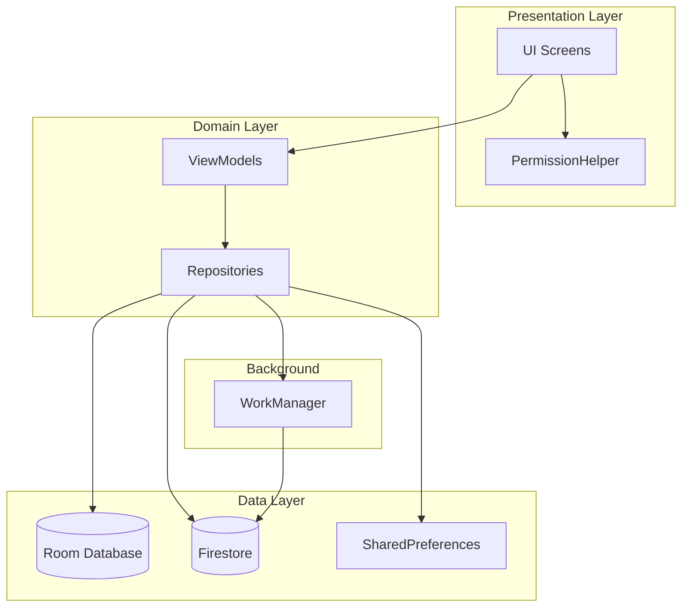
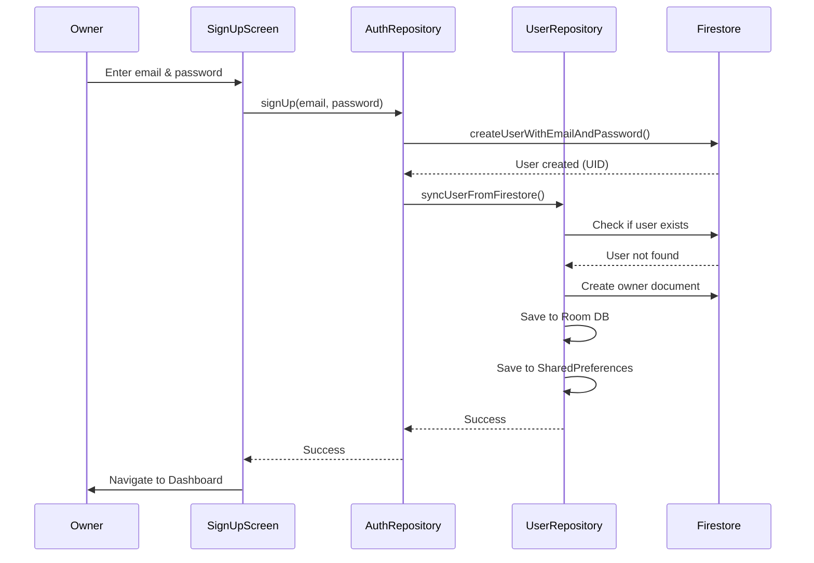
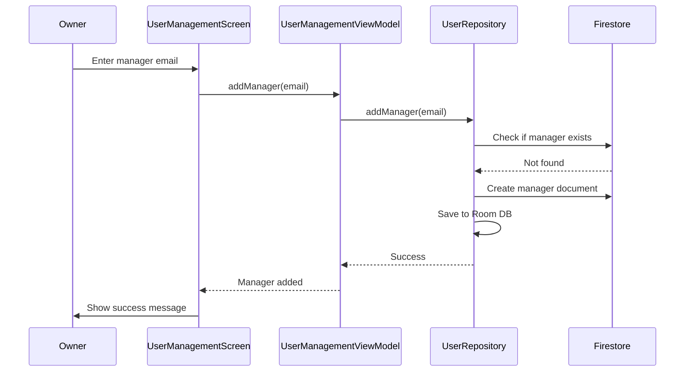
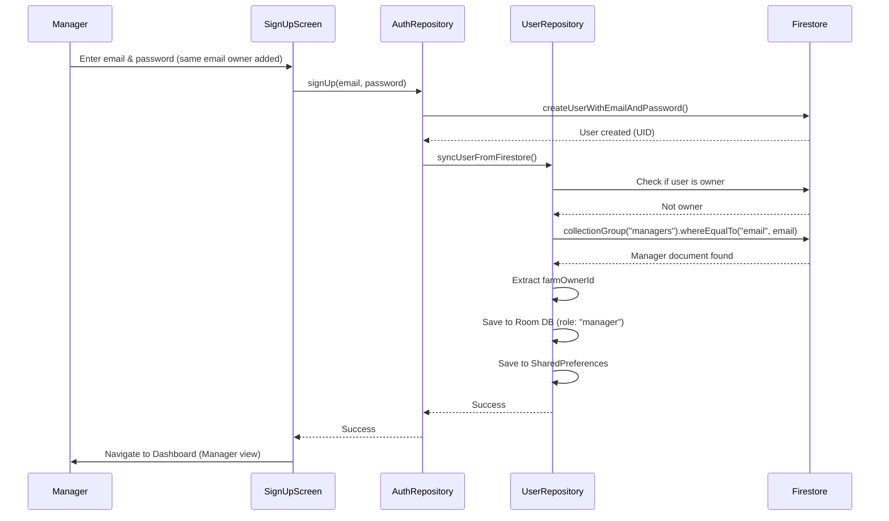
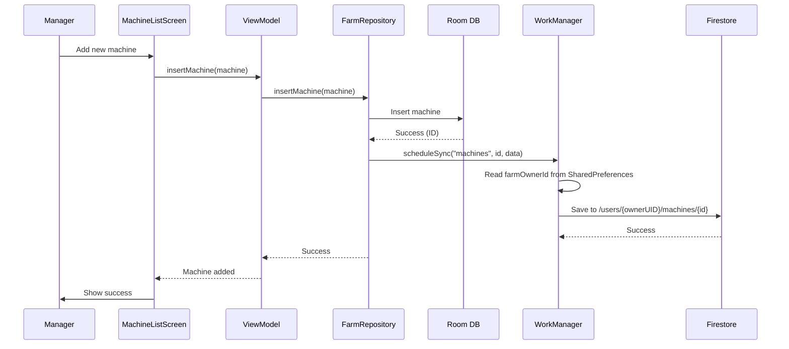

# AgriManager User Roles System - Complete Documentation

## 📋 Table of Contents

1. [Overview](#overview)
2. [System Architecture](#system-architecture)
3. [User Roles](#user-roles)
4. [Implementation Details](#implementation-details)
5. [Database Schema](#database-schema)
6. [Firestore Structure](#firestore-structure)
7. [Security Rules](#security-rules)
8. [User Flows](#user-flows)
9. [API Reference](#api-reference)
10. [Testing Guide](#testing-guide)
11. [Troubleshooting](#troubleshooting)

---

## Overview

The AgriManager User Roles System is a comprehensive multi-user farm management solution with role-based access control (RBAC). It supports two user roles: **Owner** and **Manager**, with different permission levels.

### Key Features

- ✅ Role-based access control (Owner & Manager)
- ✅ Multi-tenant data architecture
- ✅ Email-based manager invitation system
- ✅ Firestore security rules enforcement
- ✅ Local-first data architecture with cloud sync
- ✅ Permission-based UI rendering
- ✅ Centralized permission management

### Technology Stack

- **Language:** Kotlin 1.9.0
- **UI Framework:** Jetpack Compose (BOM 2023.08.00)
- **Database:** Room 2.6.1 (Version 9)
- **Dependency Injection:** Hilt 2.50
- **Backend:** Firebase (BOM 33.1.0)
  - Firebase Authentication
  - Cloud Firestore
- **Navigation:** Navigation Compose 2.7.7
- **Background Sync:** WorkManager

---

## System Architecture

### Architecture Diagram



### Data Flow

**Write Operation (Manager adds data):**
```
Manager → ViewModel → Repository → Room DB (local) → WorkManager → Firestore (owner's path)
```

**Read Operation (Owner views data):**
```
Owner Login → AuthRepository → Download from Firestore → Room DB → ViewModel → UI
```

---

## User Roles

### Owner Role

**Permissions:**
- ✅ Full CRUD access (Create, Read, Update, Delete)
- ✅ View Analytics
- ✅ Manage Users (add/remove managers)
- ✅ Access all features

**Characteristics:**
- First user to sign up becomes owner
- `farmOwnerId` equals their own UID
- All farm data is stored under their UID in Firestore

### Manager Role

**Permissions:**
- ✅ Create new records
- ✅ Read all farm data
- ✅ Update existing records
- ❌ **Cannot delete** any records
- ❌ **Cannot access** Analytics
- ❌ **Cannot manage** users

**Characteristics:**
- Invited by owner via email
- `farmOwnerId` points to their owner's UID
- Data they create is stored under owner's UID

---

## Implementation Details

### File Structure

```
app/src/main/java/com/example/agrimanager/
├── data/
│   ├── local/
│   │   ├── UserEntity.kt          # User data model
│   │   ├── UserDao.kt              # User database operations
│   │   └── FarmDatabase.kt         # Database configuration
│   └── repository/
│       ├── UserRepository.kt       # User management logic
│       ├── AuthRepository.kt       # Authentication logic
│       └── FarmRepository.kt       # Farm data operations
├── ui/
│   ├── dashboard/
│   │   ├── DashboardScreen.kt      # Main dashboard with role badges
│   │   └── PermissionHelperEntryPoint.kt
│   ├── users/
│   │   ├── UserManagementScreen.kt # Manager management UI
│   │   └── UserManagementViewModel.kt
│   ├── machine/
│   │   └── MachineListScreen.kt    # Updated with permissions
│   ├── location/
│   │   └── LocationListScreen.kt   # Updated with permissions
│   ├── employee/
│   │   └── EmployeeListScreen.kt   # Updated with permissions
│   ├── labor/
│   │   └── LaborListScreen.kt      # Updated with permissions
│   ├── maintenance/
│   │   └── MaintenanceListScreen.kt # Updated with permissions
│   └── bill/
│       └── LocationBillsScreen.kt  # Updated with permissions
├── utils/
│   ├── PermissionHelper.kt         # Centralized permission logic
│   └── PreferencesManager.kt       # User preferences storage
└── workers/
    └── FirestoreSyncWorker.kt      # Background Firestore sync

firestore.rules                      # Firestore security rules
firestore.indexes.json               # Firestore indexes
firebase.json                        # Firebase configuration
```

---

## Database Schema

### Room Database (Local)

#### UserEntity Table

```kotlin
@Entity(tableName = "users")
data class UserEntity(
    @PrimaryKey val uid: String,           // Firebase Auth UID
    val email: String,                     // User email
    val role: String,                      // "owner" or "manager"
    val farmOwnerId: String,               // Owner's UID (for data scoping)
    val addedAt: Long,                     // Timestamp
    val addedBy: String? = null            // Who added this user
)
```

**Indexes:**
- Primary Key: `uid`
- Index on: `farmOwnerId`
- Index on: `role`

#### UserDao Operations

```kotlin
@Dao
interface UserDao {
    @Insert(onConflict = OnConflictStrategy.REPLACE)
    suspend fun insertUser(user: UserEntity)
    
    @Query("SELECT * FROM users WHERE uid = :uid")
    suspend fun getUserByUid(uid: String): UserEntity?
    
    @Query("SELECT * FROM users WHERE farmOwnerId = :ownerId AND role = 'manager'")
    fun getManagersForOwner(ownerId: String): Flow<List<UserEntity>>
    
    @Delete
    suspend fun deleteUser(user: UserEntity)
}
```

---

## Firestore Structure

### Document Paths

```
/users
  /{ownerUID}                          # Owner document
    - email: "owner@example.com"
    - role: "owner"
    - farmOwnerId: "{ownerUID}"
    - addedAt: 1234567890
    
    /managers                          # Managers subcollection
      /{managerDocID}
        - email: "manager@example.com"
        - role: "manager"
        - farmOwnerId: "{ownerUID}"
        - addedAt: 1234567890
        - addedBy: "{ownerUID}"
    
    /machines                          # Farm data
      /{machineID}
        - id: 1
        - name: "Tractor"
        - dateAdded: 1234567890
    
    /fuelLogs
      /{logID}
        - id: 1
        - machineId: 1
        - date: 1234567890
        - liters: 50.0
        - rate: 100.0
        - totalCost: 5000.0
    
    /locations
    /bills
    /employees
    /transactions
    /inventoryItems
    /inventory_items
    /stockTransactions
    /stock_transactions
    /laborLogs
    /labor_logs
    /maintenanceLogs
    /maintenance_logs
```

### Data Scoping Rules

**Critical:** All farm data MUST be stored under the owner's UID:
- Owner's data: `/users/{ownerUID}/machines/`
- Manager's data: `/users/{ownerUID}/machines/` (same path!)

This ensures:
- ✅ Owner can see all data (theirs + managers')
- ✅ Managers can see all farm data
- ✅ Data isolation between different farms

---

## Security Rules

### Current Rules (firestore.rules.debug)

**Permissive rules for development:**

```javascript
rules_version = '2';
service cloud.firestore {
  match /databases/{database}/documents {
    match /{document=**} {
      allow read, write: if request.auth != null;
    }
  }
}
```

### Production Rules (firestore.rules)

**Strict role-based rules:**

```javascript
rules_version = '2';
service cloud.firestore {
  match /databases/{database}/documents {
    
    // Helper functions
    function isSignedIn() {
      return request.auth != null;
    }
    
    function isOwner() {
      return isSignedIn() && 
             exists(/databases/$(database)/documents/users/$(request.auth.uid));
    }
    
    function hasAccessToOwnerData(ownerId) {
      return isSignedIn() && (
        request.auth.uid == ownerId ||
        exists(/databases/$(database)/documents/users/$(ownerId)/managers/$(request.auth.uid))
      );
    }
    
    // Users collection
    match /users/{userId} {
      allow read: if isSignedIn() && request.auth.uid == userId;
      allow create: if isSignedIn() && request.auth.uid == userId &&
                       request.resource.data.role == 'owner' &&
                       request.resource.data.farmOwnerId == userId;
      allow update: if isSignedIn() && request.auth.uid == userId;
      allow delete: if isSignedIn() && request.auth.uid == userId;
      
      match /managers/{managerId} {
        allow read: if isSignedIn() && request.auth.uid == userId;
        allow create: if isSignedIn() && request.auth.uid == userId;
        allow update: if isSignedIn() && request.auth.uid == userId;
        allow delete: if isSignedIn() && request.auth.uid == userId;
      }
    }
    
    // Farm data collections
    match /users/{ownerId}/machines/{machineId} {
      allow read: if hasAccessToOwnerData(ownerId);
      allow create: if hasAccessToOwnerData(ownerId);
      allow update: if hasAccessToOwnerData(ownerId);
      allow delete: if isSignedIn() && request.auth.uid == ownerId;  // Owner only
    }
    
    // ... (similar rules for all other collections)
  }
}
```

### Firestore Indexes

**Required Index:**

```json
{
  "indexes": [],
  "fieldOverrides": [
    {
      "collectionGroup": "managers",
      "fieldPath": "email",
      "indexes": [
        {
          "order": "ASCENDING",
          "queryScope": "COLLECTION_GROUP"
        },
        {
          "order": "DESCENDING",
          "queryScope": "COLLECTION_GROUP"
        },
        {
          "arrayConfig": "CONTAINS",
          "queryScope": "COLLECTION_GROUP"
        }
      ]
    }
  ]
}
```

**Why needed:** The `collectionGroup("managers")` query in `UserRepository.syncUserFromFirestore()` requires this index.

---

## User Flows

### Owner Signup Flow



### Manager Invitation Flow



### Manager Signup Flow



### Manager Data Creation Flow



---

## API Reference

### PermissionHelper

**Location:** `com.example.agrimanager.utils.PermissionHelper`

**Purpose:** Centralized permission checking utility

#### Constants

```kotlin
// Roles
const val ROLE_OWNER = "owner"
const val ROLE_MANAGER = "manager"

// Features
const val FEATURE_MACHINES = "machines"
const val FEATURE_LOCATIONS = "locations"
const val FEATURE_EMPLOYEES = "employees"
const val FEATURE_BILLS = "bills"
const val FEATURE_LABOR = "labor"
const val FEATURE_MAINTENANCE = "maintenance"
const val FEATURE_ANALYTICS = "analytics"
const val FEATURE_USER_MANAGEMENT = "user_management"

// Permissions
const val PERMISSION_CREATE = "create"
const val PERMISSION_READ = "read"
const val PERMISSION_UPDATE = "update"
const val PERMISSION_DELETE = "delete"
```

#### Methods

```kotlin
// Check if user has permission
fun hasPermission(feature: String, permission: String): Boolean

// Quick permission checks
fun canCreate(feature: String): Boolean
fun canRead(feature: String): Boolean
fun canUpdate(feature: String): Boolean
fun canDelete(feature: String): Boolean

// Feature access checks
fun canAccessAnalytics(): Boolean
fun canManageUsers(): Boolean

// Role checks
fun isOwner(): Boolean
fun isManager(): Boolean
fun getUserRole(): String?
```

#### Usage Example

```kotlin
@Composable
fun MachineItem(machine: MachineEntity, permissionHelper: PermissionHelper) {
    Row {
        Text(machine.name)
        
        // Only show delete button if user can delete
        if (permissionHelper.canDelete(PermissionHelper.FEATURE_MACHINES)) {
            IconButton(onClick = { /* delete */ }) {
                Icon(Icons.Default.Delete, "Delete")
            }
        }
    }
}
```

### UserRepository

**Location:** `com.example.agrimanager.data.repository.UserRepository`

#### Methods

```kotlin
// Get current user
suspend fun getCurrentUser(): UserEntity?

// Role checks
suspend fun getCurrentUserRole(): String?
suspend fun isOwner(): Boolean
suspend fun isManager(): Boolean
suspend fun getFarmOwnerId(): String?

// Manager management
fun getAllManagers(): Flow<List<UserEntity>>
suspend fun addManager(email: String): Result<UserEntity>
suspend fun removeManager(manager: UserEntity): Result<Boolean>

// User sync
suspend fun syncUserFromFirestore(): Result<UserEntity>

// Quick sync checks (no suspend)
fun isOwnerSync(): Boolean
fun isManagerSync(): Boolean
```

### PreferencesManager

**Location:** `com.example.agrimanager.utils.PreferencesManager`

#### Methods

```kotlin
// Save user data
fun saveUserRole(role: String)
fun saveFarmOwnerId(ownerId: String)
fun saveUserEmail(email: String)

// Get user data
fun getUserRole(): String?
fun getFarmOwnerId(): String?
fun getUserEmail(): String?

// Clear data
fun clearUserData()

// Quick checks
fun isOwner(): Boolean
fun isManager(): Boolean
```

---

## Testing Guide

### Manual Testing Checklist

#### Owner Account Testing

**Signup & Login:**
- [ ] Sign up with new email
- [ ] Verify "Owner" badge appears on dashboard
- [ ] Verify "View Expense Analytics" button visible
- [ ] Verify "Manage Users" button visible

**Data Operations:**
- [ ] Create machine
- [ ] Edit machine
- [ ] Delete machine (should work)
- [ ] Verify data appears in Firestore under `/users/{ownerUID}/machines/`

**Manager Management:**
- [ ] Add manager with email
- [ ] Verify manager appears in list
- [ ] Remove manager
- [ ] Verify manager removed from list

#### Manager Account Testing

**Signup & Login:**
- [ ] Sign up with email added by owner
- [ ] Verify "Manager" badge appears on dashboard
- [ ] Verify NO "View Expense Analytics" button
- [ ] Verify NO "Manage Users" button

**Data Operations:**
- [ ] Create machine
- [ ] Edit machine
- [ ] Verify NO delete button visible
- [ ] Verify data appears in Firestore under `/users/{ownerUID}/machines/`

**Permission Restrictions:**
- [ ] Verify cannot access Analytics screen
- [ ] Verify cannot access User Management screen
- [ ] Verify delete buttons hidden in all list screens:
  - [ ] Machines
  - [ ] Locations
  - [ ] Employees
  - [ ] Bills
  - [ ] Labor Logs
  - [ ] Maintenance Logs

#### Cross-Account Testing

**Data Visibility:**
- [ ] Manager adds machine
- [ ] Owner logs out and back in
- [ ] Owner can see manager's machine
- [ ] Owner can edit manager's machine
- [ ] Owner can delete manager's machine

**Data Isolation:**
- [ ] Create second owner account
- [ ] Verify Owner A cannot see Owner B's data
- [ ] Verify Manager A cannot see Owner B's data

### Firestore Rules Testing

Use Firebase Console → Firestore → Rules Playground:

**Test 1: Owner can delete**
```
Location: /users/ownerUID123/machines/machine1
Auth UID: ownerUID123
Operation: delete
Expected: ✅ Allow
```

**Test 2: Manager cannot delete**
```
Location: /users/ownerUID123/machines/machine1
Auth UID: managerUID456
Operation: delete
Expected: ❌ Deny
```

**Test 3: Manager can read**
```
Location: /users/ownerUID123/machines/machine1
Auth UID: managerUID456
Operation: get
Expected: ✅ Allow
```

---

## Troubleshooting

### Common Issues

#### Issue 1: Permission Denied on Signup

**Symptoms:**
- "PERMISSION_DENIED: Missing or insufficient permissions" error
- User created in Firebase Auth but not in Firestore

**Causes:**
- Missing `farmOwnerId` field in user document
- Firestore rules blocking creation

**Solutions:**
1. Verify `UserRepository.kt` line 192 includes `farmOwnerId`
2. Check Firestore rules allow user creation
3. Use permissive debug rules temporarily

#### Issue 2: Collection Group Index Required

**Symptoms:**
- "FAILED_PRECONDITION: The query requires a COLLECTION_GROUP_ASC index"

**Cause:**
- Missing Firestore index for `managers.email`

**Solution:**
1. Click the link in error message
2. Or manually create index in Firebase Console
3. Collection Group: `managers`
4. Field: `email`
5. Query scope: Collection group

#### Issue 3: Manager Data Not Visible to Owner

**Symptoms:**
- Manager adds data
- Data appears in Firestore
- Owner cannot see it in app

**Causes:**
- Owner's app has cached local data
- Data not downloaded from Firestore

**Solutions:**
1. Owner logs out and back in
2. Or clear app data
3. Or force close and reopen app

#### Issue 4: Manager Data in Wrong Location

**Symptoms:**
- Manager's data at `/users/{managerUID}/` instead of `/users/{ownerUID}/`

**Cause:**
- `FirestoreSyncWorker` using current user UID instead of farm owner UID

**Solution:**
1. Verify `FirestoreSyncWorker.kt` line 23-24 reads from SharedPreferences
2. Rebuild and reinstall app
3. Delete incorrect data from Firestore

### Debug Logging

Enable logging in `FirestoreSyncWorker`:

```kotlin
android.util.Log.d("FirestoreSyncWorker", "Syncing to: /users/$userId/$collection/$docId")
android.util.Log.d("FirestoreSyncWorker", "Farm Owner ID: $farmOwnerId")
```

View logs in Android Studio → Logcat → Filter: "FirestoreSyncWorker"

### Firestore Console Debugging

**Check User Document:**
```
/users/{uid}
  - role: "owner" or "manager"
  - farmOwnerId: should match owner's UID
  - email: user's email
```

**Check Manager Document:**
```
/users/{ownerUID}/managers/{managerDocID}
  - email: manager's email
  - role: "manager"
  - farmOwnerId: owner's UID
```

**Check Data Location:**
```
/users/{ownerUID}/machines/  ← Should contain data from both owner and managers
```

---

## Best Practices

### Security

1. **Always use Firestore rules** - Never rely solely on UI permissions
2. **Validate on server** - Rules enforce permissions at database level
3. **Use strict rules in production** - Switch from debug rules to strict rules
4. **Audit user actions** - Track who created/modified data

### Performance

1. **Local-first architecture** - Save to Room first, sync in background
2. **Batch operations** - Use WorkManager for efficient syncing
3. **Index properly** - Create indexes for frequently queried fields
4. **Cache user role** - Use SharedPreferences for quick access

### User Experience

1. **Clear role indicators** - Show role badges on dashboard
2. **Hide unavailable features** - Don't show buttons users can't use
3. **Provide feedback** - Show loading states during sync
4. **Handle offline** - App works offline, syncs when online

### Code Organization

1. **Centralize permissions** - Use `PermissionHelper` for all checks
2. **Consistent patterns** - Apply same permission checks across screens
3. **Document changes** - Comment why permissions are checked
4. **Test thoroughly** - Verify both owner and manager flows

---

## Migration Guide

### Switching to Strict Rules

**Current:** Using `firestore.rules.debug` (permissive)

**To switch to strict rules:**

1. **Backup data** (optional but recommended)

2. **Deploy strict rules:**
   - Open Firebase Console → Firestore → Rules
   - Copy content from `firestore.rules`
   - Paste and Publish

3. **Test thoroughly:**
   - Test owner signup
   - Test manager signup
   - Test data operations
   - Test permissions

4. **Monitor errors:**
   - Check Firebase Console → Firestore → Usage
   - Look for permission denied errors

### Adding New Features

**To add a new feature with permissions:**

1. **Add feature constant** to `PermissionHelper.kt`:
   ```kotlin
   const val FEATURE_NEW_FEATURE = "new_feature"
   ```

2. **Update permission map** in `PermissionHelper.kt`:
   ```kotlin
   FEATURE_NEW_FEATURE to mapOf(
       PERMISSION_CREATE to listOf(ROLE_OWNER, ROLE_MANAGER),
       PERMISSION_READ to listOf(ROLE_OWNER, ROLE_MANAGER),
       PERMISSION_UPDATE to listOf(ROLE_OWNER, ROLE_MANAGER),
       PERMISSION_DELETE to listOf(ROLE_OWNER)
   )
   ```

3. **Add Firestore rules** in `firestore.rules`:
   ```javascript
   match /users/{ownerId}/newFeature/{docId} {
       allow read: if hasAccessToOwnerData(ownerId);
       allow create: if hasAccessToOwnerData(ownerId);
       allow update: if hasAccessToOwnerData(ownerId);
       allow delete: if isSignedIn() && request.auth.uid == ownerId;
   }
   ```

4. **Update UI** to check permissions:
   ```kotlin
   if (permissionHelper.canDelete(PermissionHelper.FEATURE_NEW_FEATURE)) {
       // Show delete button
   }
   ```

---

## FAQ

**Q: Can a manager become an owner?**
A: No, roles are fixed. A manager would need to sign up as a new owner with a different email.

**Q: Can one person be a manager for multiple owners?**
A: Not currently supported. Each user can only have one role and one farm association.

**Q: How do I remove all managers?**
A: Use the "Manage Users" screen to remove managers one by one.

**Q: What happens if I delete a manager?**
A: The manager document is deleted, but their data remains (it's under the owner's UID).

**Q: Can managers see each other?**
A: No, managers can only see farm data, not other managers.

**Q: How do I backup my data?**
A: Use Firebase Console → Firestore → Export to backup all data.

**Q: Can I have multiple owners?**
A: Each farm has one owner. Multiple people can create separate owner accounts for different farms.

**Q: What if a manager forgets their password?**
A: Use Firebase Auth password reset functionality.

---

## Appendix

### Version History

**v1.0.0** (Current)
- Initial implementation
- Owner and Manager roles
- Permission-based UI
- Firestore security rules
- Background sync with WorkManager

### Related Documentation

- [Phase 1 Walkthrough](phase1_walkthrough.md) - Database & Repository
- [Phase 3 Walkthrough](phase3_walkthrough.md) - User Management UI
- [Phase 5 Walkthrough](phase5_walkthrough.md) - List Screens Updates
- [Phase 6 Walkthrough](phase6_walkthrough.md) - Firestore Integration

### External Resources

- [Firebase Authentication Docs](https://firebase.google.com/docs/auth)
- [Firestore Security Rules](https://firebase.google.com/docs/firestore/security/get-started)
- [WorkManager Guide](https://developer.android.com/topic/libraries/architecture/workmanager)
- [Jetpack Compose](https://developer.android.com/jetpack/compose)

---

**Document Version:** 1.0.0  
**Last Updated:** December 10, 2025  
**Author:** AgriManager Development Team
